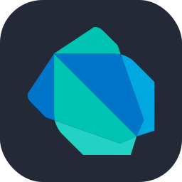

<h1 align="center">👋 Hi, I'm louahem alaa</h1>
<h3 align="center">Computer Science Student | Graphic Designer | Developer</h3>

---

## 👨‍💻 About Me
- 🎓 Computer Science (Informatique – LMD)
- 🎨 Graphic Designer (Photoshop & Illustrator)
- 💻 Developer (Flutter, C, C++, Web)
- 🌐 Interested in Networking & Cyber Security
- 🚀 Always learning new technologies

---

## 🛠️ Skills & Tools

### 🎨 Design

  
  
  

### 💻 Programming

  
  
  
  
  
  
  

### 🗄️ Databases

  

     
### 🌐 Networking

  
  

### 🖥️ Operating Systems

  
  

### ⚙️ Tools

  
  
  
  

---

## 📊 GitHub Stats

---

## 🌐 Connect with Me

  
  

---

⭐ *Feel free to check my repositories and projects!*
